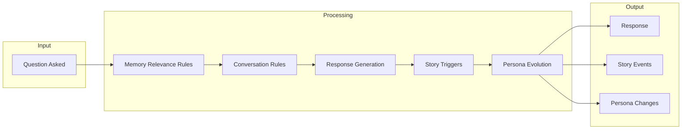
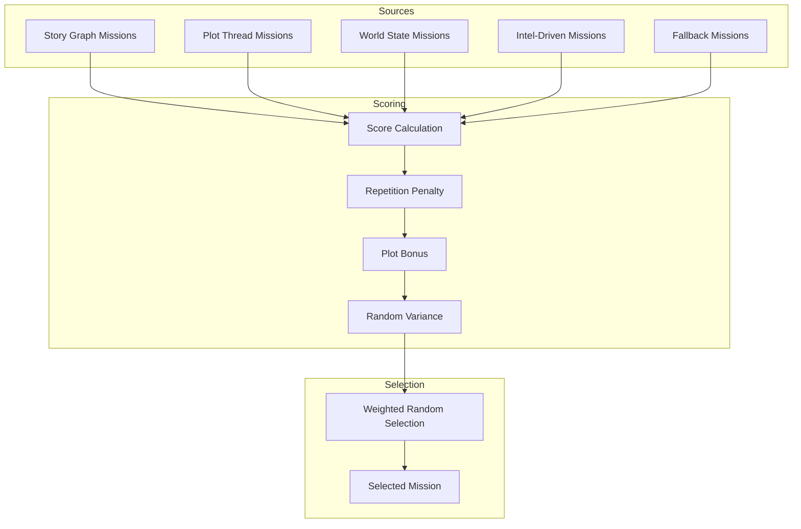

# Story System Architecture

This document describes the architecture of the Story System for the MafiaDemo game.

## Overview

The Story System provides dynamic narrative generation through interconnected components:
- **World State** - Persistent game state (locations, NPCs, factions)
- **Story Graph** - Narrative structure with plot threads and missions
- **Intelligence** - Information gathering and sharing between agents
- **Agents** - Personas and memories for NPCs and player
- **Rules Engine** - Decision making for conversations and consequences

## System Architecture

```mermaid
graph TB
    subgraph Core["Core Layer"]
        Enums[Enums.cs]
        Thresholds[Thresholds.cs]
    end

    subgraph World["World State Layer"]
        Location[Location]
        NPC[NPC]
        Faction[Faction]
        WorldState[WorldState]

        WorldState --> Location
        WorldState --> NPC
        WorldState --> Faction
    end

    subgraph Narrative["Narrative Layer"]
        StoryNode[StoryNode]
        StoryEdge[StoryEdge]
        PlotThread[PlotThread]
        StoryGraph[StoryGraph]
        StoryEvent[StoryEvent]

        StoryGraph --> StoryNode
        StoryGraph --> StoryEdge
        StoryGraph --> PlotThread
        StoryGraph --> StoryEvent
    end

    subgraph Intelligence["Intelligence Layer"]
        Intel[Intel]
        IntelRegistry[IntelRegistry]

        IntelRegistry --> Intel
    end

    subgraph Agents["Agent Layer"]
        Persona[Persona]
        Goal[Goal]
        Memory[Memory]
        MemoryBank[MemoryBank]
        EntityMind[EntityMind]

        EntityMind --> Persona
        EntityMind --> MemoryBank
        Persona --> Goal
        MemoryBank --> Memory
    end

    subgraph Communication["Communication Layer"]
        AgentQuestion[AgentQuestion]
        AgentResponse[AgentResponse]
        ConversationContext[ConversationContext]
        ResponseDecision[ResponseDecision]

        ConversationContext --> AgentQuestion
        ConversationContext --> ResponseDecision
    end

    subgraph Rules["Rules Layer"]
        ConversationRules[ConversationRulesSetup]
        EvolutionRules[EvolutionRulesSetup]
        StoryTriggerRules[StoryTriggerRulesSetup]
        MemoryRelevanceRules[MemoryRelevanceRulesSetup]
        ConsequenceRules[ConsequenceRulesSetup]
    end

    subgraph Engine["Engine Layer"]
        ConversationEngine[RulesBasedConversationEngine]

        ConversationEngine --> ConversationRules
        ConversationEngine --> EvolutionRules
        ConversationEngine --> StoryTriggerRules
        ConversationEngine --> MemoryRelevanceRules
    end

    subgraph Generation["Generation Layer"]
        MissionHistory[MissionHistory]
        DynamicMissionGenerator[DynamicMissionGenerator]
        MissionCandidate[MissionCandidate]

        DynamicMissionGenerator --> MissionHistory
        DynamicMissionGenerator --> MissionCandidate
    end

    subgraph Seeding["Seeding Layer"]
        WorldStateSeeder[WorldStateSeeder]
    end

    %% Cross-layer dependencies
    WorldState --> EntityMind
    ConversationEngine --> WorldState
    ConversationEngine --> StoryGraph
    ConversationEngine --> EntityMind
    DynamicMissionGenerator --> WorldState
    DynamicMissionGenerator --> StoryGraph
    DynamicMissionGenerator --> IntelRegistry
    WorldStateSeeder --> WorldState
    WorldStateSeeder --> StoryGraph
```



## Data Flow



## Mission Generation Flow



## File Structure

```
Story/
├── Core/
│   ├── Enums.cs              # All enumeration types
│   └── Thresholds.cs         # Centralized constants
├── World/
│   ├── Location.cs           # Physical locations
│   ├── NPC.cs                # Non-player characters
│   ├── Faction.cs            # Rival families
│   └── WorldState.cs         # Central state container
├── Narrative/
│   ├── StoryNode.cs          # Nodes, edges, plot threads
│   ├── StoryGraph.cs         # Graph management
│   └── StoryEvent.cs         # Event logging
├── Intelligence/
│   ├── Intel.cs              # Intelligence data
│   └── IntelRegistry.cs      # Intel management
├── Agents/
│   ├── Persona.cs            # Personality traits
│   ├── Memory.cs             # Memory and MemoryBank
│   └── EntityMind.cs         # Combined persona/memory
├── Communication/
│   ├── AgentQuestion.cs      # Question types
│   ├── AgentResponse.cs      # Response types
│   └── ConversationContext.cs # Context and decisions
├── Rules/
│   ├── ConversationRulesSetup.cs    # Response rules
│   ├── EvolutionRules.cs            # Character change rules
│   ├── StoryTriggerRules.cs         # Narrative trigger rules
│   ├── MemoryRelevanceRules.cs      # Memory scoring rules
│   └── ConsequenceRules.cs          # Mission outcome rules
├── Engine/
│   └── RulesBasedConversationEngine.cs # Main conversation engine
├── Generation/
│   ├── MissionHistory.cs            # Repetition tracking
│   └── DynamicMissionGenerator.cs   # Mission generation
├── Seeding/
│   └── WorldStateSeeder.cs          # Initial world setup
└── ARCHITECTURE.md                  # This document
```

## Key Design Decisions

### Rules-Based Decision Making
All behavioral decisions use the RulesEngine pattern:
- **Configurable** - Add rules without changing code
- **Debuggable** - See which rules fired and why
- **Consistent** - Same pattern as game rules
- **Extensible** - Mods can add new rules

### Memory System
Memories use salience-based recall:
- High-salience memories persist longer
- Emotional memories decay slower
- Frequently accessed memories strengthen
- Automatic pruning prevents unbounded growth

### Story Graph
Narrative uses a directed graph with typed edges:
- **Unlocks** - Completing A makes B available
- **Blocks** - A active prevents B
- **Triggers** - A automatically starts B
- **Requires** - B needs A completed first
- **Conflicts** - A and B are mutually exclusive

### Mission Generation
Dynamic mission generation balances variety:
- Story-driven missions (plot threads)
- World state reactive missions
- Intel-driven opportunities
- Fallback generated missions
- Repetition penalties ensure variety

## Integration Points

1. **GameEngine** - Initialize WorldState and StoryGraph at game start
2. **AgentRouter** - Intel flows through agent hierarchy
3. **RulesEngine** - Consequences evaluated after mission completion
4. **PlayerAgent** - Uses DynamicMissionGenerator for missions
