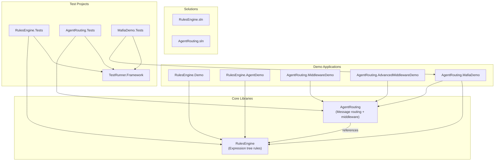
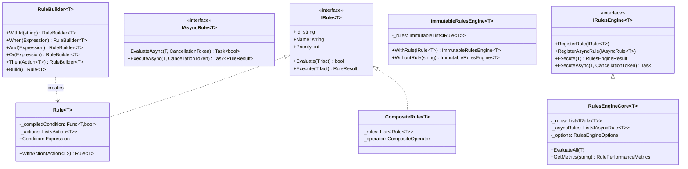
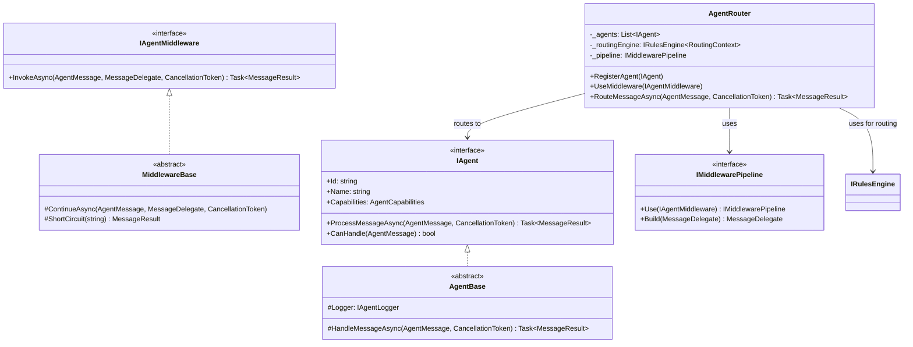
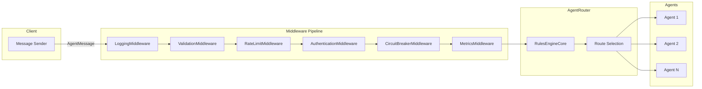
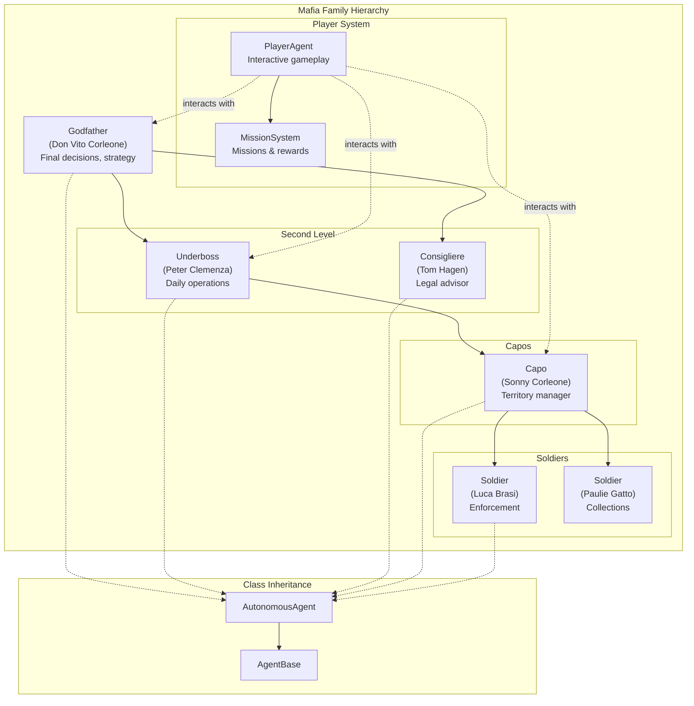

# MafiaAgentSystem

A multi-agent communication framework with a rules engine, built in C# with zero external dependencies.

## Overview

MafiaAgentSystem consists of two core libraries and a demonstration application:

| Component | Description |
|-----------|-------------|
| **RulesEngine** | Expression tree-based business rules engine |
| **AgentRouting** | Multi-agent message routing with middleware pipeline |
| **MafiaDemo** | Mafia family simulation demonstrating both systems |

## Architecture

### Solution Structure



### RulesEngine Class Hierarchy



### AgentRouting Class Hierarchy



### Message Flow & Middleware Pipeline



### Available Middleware

| Common Middleware | Advanced Middleware |
|-------------------|---------------------|
| LoggingMiddleware | DistributedTracingMiddleware |
| TimingMiddleware | SemanticRoutingMiddleware |
| ValidationMiddleware | MessageTransformationMiddleware |
| RateLimitMiddleware | MessageQueueMiddleware |
| CachingMiddleware | ABTestingMiddleware |
| RetryMiddleware | FeatureFlagsMiddleware |
| CircuitBreakerMiddleware | AgentHealthCheckMiddleware |
| MetricsMiddleware | WorkflowOrchestrationMiddleware |
| AuthenticationMiddleware | |
| PriorityBoostMiddleware | |
| EnrichmentMiddleware | |
| AnalyticsMiddleware | |

### MafiaDemo Agent Hierarchy



## Quick Start

### Prerequisites

- .NET 8.0 SDK

### Build

```bash
# Restore (offline - no NuGet access needed)
dotnet restore AgentRouting/AgentRouting.sln --source /nonexistent

# Build
dotnet build AgentRouting/AgentRouting.sln --no-restore
```

### Run Tests

```bash
# Build test projects
dotnet build Tests/RulesEngine.Tests/ --no-restore
dotnet build Tests/AgentRouting.Tests/ --no-restore
dotnet build Tests/MafiaDemo.Tests/ --no-restore
dotnet build Tests/TestRunner/ --no-restore

# Run all tests
dotnet run --project Tests/TestRunner/ --no-build
```

### Run MafiaDemo

```bash
dotnet run --project AgentRouting/AgentRouting.MafiaDemo/
```

## Project Structure

```
MafiaAgentSystem/
├── RulesEngine/
│   ├── RulesEngine/              # Core rules engine library
│   │   ├── Core/                 # IRule, Rule, RulesEngineCore, etc.
│   │   ├── Enhanced/             # RuleValidation
│   │   └── Examples/             # Example rules
│   ├── RulesEngine.Demo/         # Basic demo
│   └── RulesEngine.AgentDemo/    # Agent integration demo
│
├── AgentRouting/
│   ├── AgentRouting/             # Core routing library
│   │   ├── Core/                 # IAgent, AgentRouter, AgentMessage
│   │   ├── Middleware/           # 20+ middleware implementations
│   │   ├── Infrastructure/       # StateStore, SystemClock
│   │   ├── Configuration/        # Defaults
│   │   └── DependencyInjection/  # ServiceContainer
│   ├── AgentRouting.MafiaDemo/   # Mafia game demo
│   ├── AgentRouting.MiddlewareDemo/
│   └── AgentRouting.AdvancedMiddlewareDemo/
│
└── Tests/
    ├── TestRunner.Framework/     # Custom test framework (zero dependencies)
    ├── TestRunner/               # Test runner
    ├── RulesEngine.Tests/
    ├── AgentRouting.Tests/
    └── MafiaDemo.Tests/
```

## Key Features

### RulesEngine

- **Expression Trees**: Type-safe, compiled rule conditions
- **Fluent Builder**: Readable rule construction API
- **Composite Rules**: AND/OR/NOT combinations
- **Async Support**: Rules with I/O operations
- **Performance Tracking**: Execution metrics per rule
- **Thread-Safe Variant**: `ImmutableRulesEngine<T>`

### AgentRouting

- **Message Routing**: Rules-based agent selection
- **Middleware Pipeline**: ASP.NET Core-style request pipeline
- **20+ Built-in Middleware**: Logging, caching, rate limiting, circuit breaker, etc.
- **Agent Capabilities**: Skill-based routing
- **Broadcast Support**: Send to multiple agents

### MafiaDemo

- **Hierarchical Agents**: Godfather → Underboss → Capos → Soldiers
- **Autonomous Decisions**: Personality-driven agent behavior
- **Player Mode**: Interactive gameplay with missions
- **Rules Integration**: Game logic via RulesEngine

## Origins

> The story of how a deep dive into expression trees led to a production-ready rules engine and agent communication platform.

This project began as an exploration of **C# expression trees** - a powerful but often overlooked feature of the .NET framework. What started as a learning exercise evolved into a comprehensive agent-to-agent communication system.

### The Journey

**Expression Trees → Rules Engine → Agent Routing → MafiaDemo**

1. **Expression Trees**: Unlike compiled delegates (opaque black boxes), expression trees represent **code as data** - enabling inspection, modification, and composition of logic at runtime.

2. **The "Aha" Moment**: Expression trees are perfect for building a **rules engine** where business rules become first-class data that can be inspected, prioritized, and tested in isolation.

3. **Agent Communication**: Rules engines make decisions. Agents make decisions. This led to **AgentRouting** - a message routing system where agents use rules to decide how to handle, forward, or escalate messages.

4. **MafiaDemo**: To stress-test both systems, we built a mafia family simulation where hierarchy = routing, decisions = rules, and communication = message passing.

### Key Insight

> **Expression trees unlock a fundamental shift: rules become first-class data.**

```csharp
// Regular delegate - opaque, can only execute
Func<Order, bool> isLarge = order => order.Total > 1000;

// Expression tree - inspectable AND executable
Expression<Func<Order, bool>> isLarge = order => order.Total > 1000;
// Can examine: body.NodeType == GreaterThan, body.Left == order.Total, body.Right == 1000
```

This separation of rule definitions from execution logic enables dynamic business rules, configurable workflows, intelligent agent routing, and auditable decision-making.

For the full story, see [ORIGINS.md](ORIGINS.md).

## Documentation

| Document | Description |
|----------|-------------|
| [ORIGINS.md](ORIGINS.md) | How expression trees led to this architecture |
| [CLAUDE.md](CLAUDE.md) | Development guide and commands |
| [RulesEngine/README.md](RulesEngine/README.md) | RulesEngine documentation |
| [AgentRouting/README.md](AgentRouting/README.md) | AgentRouting documentation |
| [AgentRouting/MIDDLEWARE_EXPLAINED.md](AgentRouting/MIDDLEWARE_EXPLAINED.md) | Middleware tutorial |
| [MafiaDemo/ARCHITECTURE.md](AgentRouting/AgentRouting.MafiaDemo/ARCHITECTURE.md) | Game architecture |

## License

Educational project - use freely for learning and building.
